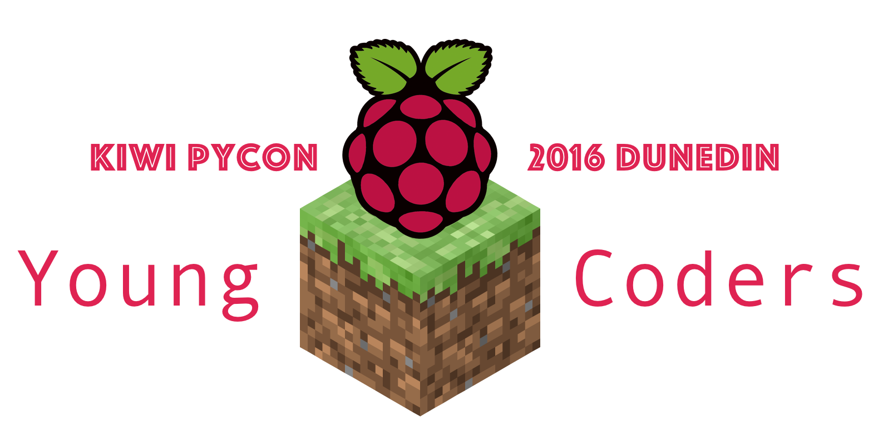

\pagebreak

# Supporters and Sponsors

Thanks to our awesome supporters and sponsors who have made Young Coders 2016 possible.


\pagebreak

# Workshop 1: Stamp Sheet

After you complete an exercise, ask a Young Coders helper to review your work and receive a stamp on your stamp sheet.


\pagebreak

# Workshop 1: Let's Learn Python!

## Workshop 1, Exercise 1: Hello World

One of the first programs you usually write, when learning how to program is 'Hello World'.
'Hello World' is a simple program which prints the text 'Hello World!' somewhere - usually to a terminal or console window, but today we're going to print 'Hello World!' in Minecraft!

1. Make sure your Raspberry Pi is booted up. You should see a desktop with Young Coders wallpaper and a menu button in the top left. If you don't see a desktop, please ask a Young Coders helper for a hand.

2. Open Minecraft Pi, and click *Start Game*.

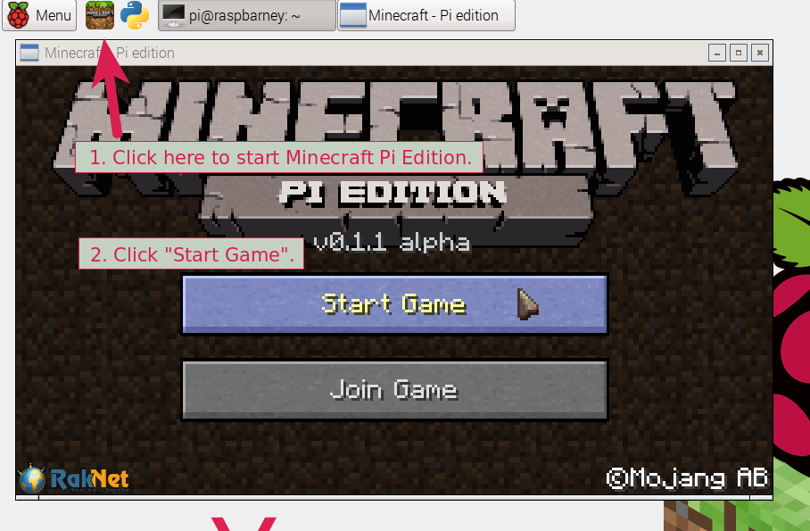

\pagebreak

3. Open the selected world.

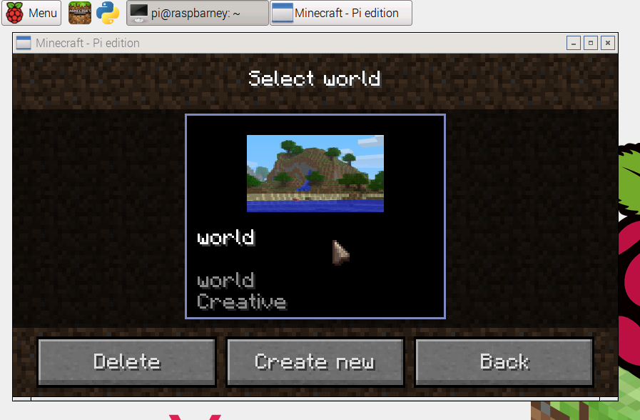

4. Open the python editor IDLE.

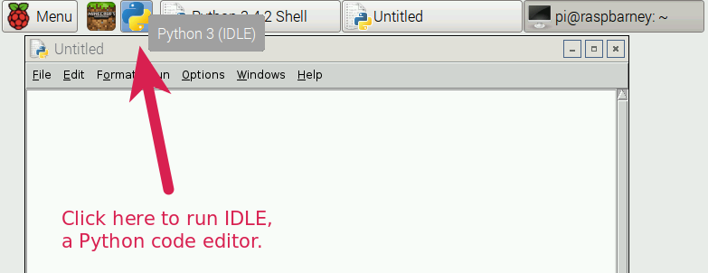

**Note**: To get your desktop cursor back from Minecraft, hit the ESC key.

5. Type the following code in the new editor window:

```python
from mcpi.minecraft import Minecraft
mc = Minecraft.create()

mc.postToChat('Hello World!')
```

6. Click *File > Save* and save this file as `helloworld.py`.

7. Click *Run > Run Module* in IDLE to run this program. You should see the text "Hello World!" appear in your Minecraft chat window.


### Learning about variables

In Python, we can store data in something called a variable. We're going to store a *string* in a *variable*. In Python, a string is a bit of text inside either ' ' or " ". In our earlier code, the data was the *string* `'Hello World!'`.

Let's create a variable called `message` and assign it a different string.

We can then print the message out by calling `mc.postToChat` with it.

1. Edit your program so that it looks like the following one:

```python
from mcpi.minecraft import Minecraft
mc = Minecraft.create()

message = 'Hello Minecraft World!'
mc.postToChat(message)
```

2. Click *Run > Run Module* in IDLE to run this program. If you see a dialog popup that says "Source must be saved.", click OK.

You should see the text "Hello Minecraft World!" appear in your Minecraft chat window.

**Hint**: to switch between Minecraft and IDLE windows, you can use *Alt+Tab*.

### Joining string variables

We can also join strings together to print out messages with several variables.

1. Edit your program and make variables for your first name and last name.

```python
from mcpi.minecraft import Minecraft
mc = Minecraft.create()

name = 'Type your name here'
mc.postToChat('Hello ' + name + '!')
```

2. Click *Run > Run Module* in IDLE to run this program. You should see yourself greeted in the Minecraft window.

**Hint**: A quick way to run your code is the *F5* key.

\pagebreak

### Asking for input

Instead of directly assigning our name to the variable `name`, we can ask our program to prompt us for a name using `input`.

1. Edit your program and assign the result of `input` to the `name` variable.

```python
from mcpi.minecraft import Minecraft
mc = Minecraft.create()

name = input('What is your name?')
mc.postToChat('Hello ' + name + '!')
```

2. Click *Run > Run Module* in IDLE to run this program. Once again, save your file if prompted.

You should see yourself greeted in the Minecraft window.


Well done, you've completed the first exercise! Ask a Young Coders helper to review your code and get a stamp!

\pagebreak

## Workshop 1, Exercise 2a: Let's Teleport!

Now that we know about variables, we can use them to teleport Steve all over the place in style!

In Minecraft Pi, you can see your current position in the world in the top left of the screen.

XXX: Screenshot showing coordiates in Minecraft Pi.

Coordinates have 3 parts which we can use to represent a position in 3d space: x, y and z.

Let's create variables for x, y and z.

1. In IDLE, Select *File > New* to open a new editor window.

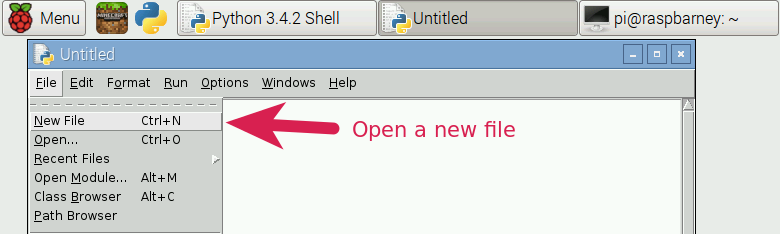

2. Type in the following code:

```python
from mcpi.minecraft import Minecraft
mc = Minecraft.create()

x = -5.4
y = 12.0
z = -14.4

mc.player.setTilePos(x, y, z)
```

Remember, if you want to go back to the start, change x, y and z back to their original values.

3. Click *File > Save* and save this file as `teleport.py`.

4. Click *Run > Run Module* in IDLE to run this program. You should see Steve teleported to a new location.

5. Go back to your original coordinates. (-5.4, 12, -14)

6. Try to teleport to the top of the tower on the left. Once you have reached the top of the tower, you'll find a secret message. Whisper the secret message to a Young Coders helper, to complete the exercise and receive a stamp.


## Workshop 1, Exercise 2b: Teleportation Tour

You may have noticed that there are two towers in our world. Let's write some code that let's us teleport from our starting location, to the top of the tower on the left, to the top of the tower on the right, and finally back to the start!

1. Modify our previous program, to teleport Steve from one place to another.

The code below is *incomplete* - you will need to fill in the blanks where the code is commented. Comments look like:

```python
# Todo: Add variable and x coordinates for tower_2
```

Look for comments in the code, starting with '#' to figure out what you need to fix.

```python
from mcpi.minecraft import Minecraft
mc = Minecraft.create()

start_x = -5.4
start_y = 12.0
start_z = -14.4

tower_1_x = 0 # Todo: Add x coordinates for tower_1
tower_1_y = 0 # Todo: Add y coordinates for tower_1
tower_1_z = 0 # Todo: Add z coordinates for tower_1

# Todo: Add variable and x coordinates for tower_2
# Todo: Add variable and y coordinates for tower_2
# Todo: Add variable and z coordinates for tower_2 

mc.player.setTilePos(start_x, start_y, start_z)
mc.player.setTilePos(tower_1_x, tower_1_y, tower_1_z)
# Todo: teleport to tower 2 using mc.player.setTilePos
# Todo: teleport back to start using mc.player.setTilePos

```
Got it working? Ask a Young Coders helper to review your code!

\pagebreak

## Workshop 1, Exercise 2c: Less Nauseating Teleportation Tour

You might have noticed that the last bit of code made Steve teleport around pretty quickly - the poor guy's going to be sick!


Let's see if we can make his Teleportation Tour a little more comfortable...

Python has a handy module called `time` which we can import to do all sorts of time related things, including pausing our program!

1. Add another import statement to the top of your code:

```python
import time

from mcpi.minecraft import Minecraft
```

2. Now use `time.sleep()` in your code to pause a few seconds after every time Steve teleports to a new location.

*Hint:* time.sleep() is a *function* which takes a number of seconds as it's parameter (similar to how `setTilePos` takes coordinates as parameters).

Figure it out? Ask a Young Coders helper if you're stuck, or think you've got it working!

\pagebreak

## Workshop 1, Exercise 3a: Blockomancy

### Let's make blocks with code!

In Minecraft, every block type, from diamond to cactus, has a *block id*. (*Learn to Program with Minecraft* has a handy *block id* reference on page 285).

Let's make a program that creates a cobblestone block at Steve's location.

1. In IDLE, select *File > New* to open a new editor window.

2. Type the following code in the new editor window:

```python
from mcpi.minecraft import Minecraft
mc = Minecraft.create()

block_id = 4  # 4 is the id for cobblestone 
pos = mc.player.getTilePos()

x = pos.x
y = pos.y
z = pos.z
mc.setBlock(x, y, z, block_id)
```

3. Click *File > Save* and save this file as `blocks.py`.

4. Click *Run > Run Module* in IDLE to run your program.

5. Experiment with changing the value of `block_id` and see what other types of blocks you can create.

## Workshop 1, Exercise 3b: Blockstacking

Let's extend our block program, so that we can create stacks of blocks.

1. Edit your program

```python
from mcpi.minecraft import Minecraft
mc = Minecraft.create()

block_id = 4  # 4 is the id for cobblestone 
pos = mc.player.getTilePos()

x = pos.x
y = pos.y
z = pos.z
mc.setBlock(x, y, z, block_id)

y = y + 1 # increase the height of our block by 1 unit
mc.setBlock(x, y, z, block_id)
```

2. Try to write a program that will create an even larger stack of blocks.

Got it working? Ask a Young Coders helper to have a look.

\pagebreak

**If you still have time left, you can try the following bonus exercice!**

## Workshop 1, Bonus Exercise: Blockomancy Plus

Let's improve our block creating program, so that it asks for user input. We've got a tricky situation though - the input() function returns a `string`, but the setBlock() function requires a *number* which in programming we call an *integer*.

### Learning about Strings and Integers

First let's see what happens when we try to add numbers together as strings in the IDLE shell. The IDLE shell is a handy tool that will run the python code you type after you hit *enter*. It isn't a great way to write long programs, but it can be very handy for learning and exploring.

1. Find the IDLE shell window. It will have a prompt starting with `>>>`.

2. Let's try adding some numbers together as strings:

`>>> '1' + '2'`

What is the result? The answer you get back is correct, because we have joined the strings `'1'` and `'2'` together, but it won't help us solve any maths problems!

To make the code above return `3`, we can use the `int()` function. When you pass a string to `int()` e.g. `int('1')` it will convert it to an integer.

`>>> int('1') + int('2')`

You can also of course type:

`>>> 1 + 2`

### Updating our Block program to use input() and int()

1. In IDLE, Select *File > New* to open a new editor window.

The program below is incomplete, and you'll need to fix the bits that say `# TODO:`!

2. Type and update the program below to ask for user input for the block_id:


```python
from mcpi.minecraft import Minecraft
mc = Minecraft.create()

block_id = # TODO: get block_id from user input, remember to convert to an integer!
pos = mc.player.getTilePos()

x = pos.x
y = pos.y
z = pos.z
mc.setBlock(x, y, z, block_id)
```

Does your program work? Ask a helper to check your code.

Well done!

\pagebreak


# Workshop 2: Stamp Sheet

After you complete an exercise, ask a Young Coders helper to review your work and receive a stamp on your stamp sheet.


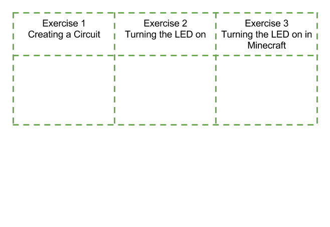

\pagebreak

# Workshop 2: Magic Door

## Getting started with the Raspberry Pi

Raspberry Pis are tiny but capable little computers, that have similar stuff inside to what you would find in a desktop PC or Mac:

* CPU (you can think of this as the brain of the computer)
* RAM (the computer's memory)
* HDMI Video port (for connecting a monitor)
* USB ports (for connecting a keyboard, mouse and other devices)
* Audio port (for connecting headphones, or speakers)

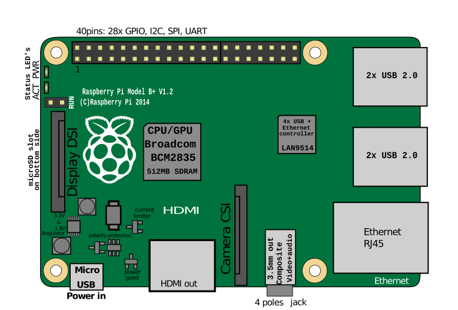

A Raspberry Pi is also a bit different from a desktop computer, as it has one very special feature - the *GPIO Port*.


The GPIO port is the set of 24 pins you see in the picture above. GPIO stands for General-purpose Input Output, and is the way the Raspberry Pi can talk to the outside world, controlling special devices, sensors and other electronic doodads. With GPIO, the Raspberry Pi goes from being just a little computer, to the heart and brain of all sorts of amazing inventions. 


In this workshop, we'll be creating a Magic Door in Minecraft, using the Pi's GPIO port and some electronics components. This magic door will turn an LED connected to our PI on and off every time the door opens and shuts in Minecraft.

### Components

#### Breadboards

A breadboard lets us create circuits without having to solder components together. This is great when you want to experiment and change components around (the fancy name for this is *prototyping*). You can't see them under your breadboard because of the adhesive backing, but each row of 5 wee holes is connected by metal clips.

You might be wondering why it is called a breadboard. In the early days of electronics, hobbiests sometimes made circuits on *actual* breadboards. I bet their parents weren't very impressed!

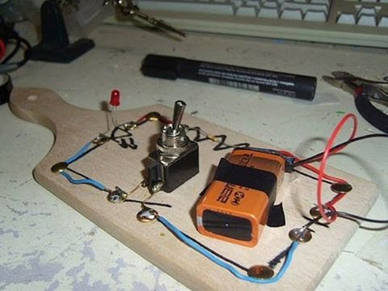

#### LEDs (Light Emitting Diodes)
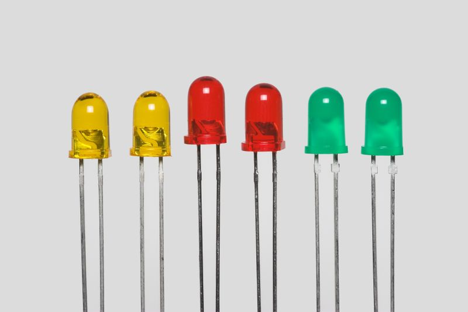

LEDs are electronic components that light up when a current is passed through them.

\pagebreak

#### Resistors


A resister is a component that limits the amount of current passing through a circuit. We're going to use one to prevent our LED from burning out too soon.

#### Male to Female jumper cables


Jumper cables allow us to create a circuit from the GPIO pins to our breadboard.

\pagebreak

## Workshop 2, Exercise 1: Creating a Circuit

We're going to make a simple circuit using our breadboard now.

While we're making our circuit, it's important that the Raspberry Pi is switched *off* to help prevent damage to our electronic components.

1. Shutdown your Raspberry Pi. Click *Menu > Shutdown... > Shutdown*.

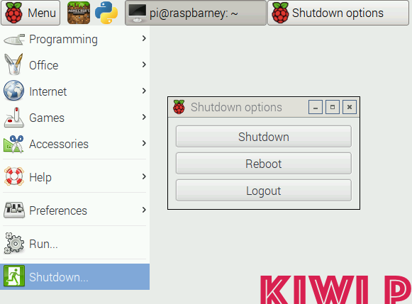
\pagebreak

2. Wait a moment, and then disconnect the power.

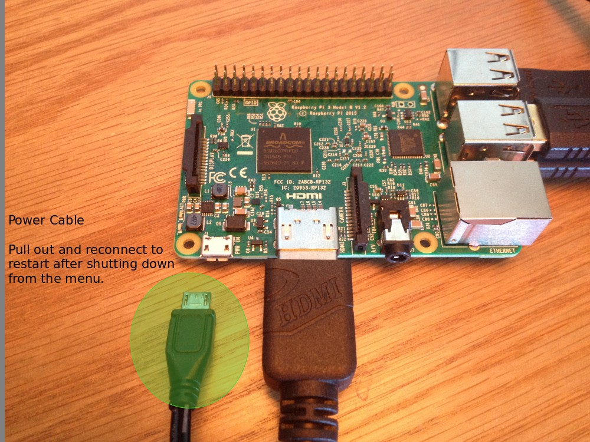
\pagebreak

3. Wiring up our test circuit

Our first circuit is going to test that our components are working correctly and we have our circuit wired up the right way. 

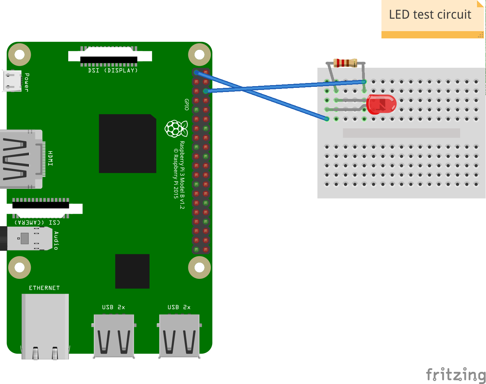

4. Turn your Pi back on by reconnecting the power.

If your circuit is wired up correctly, the LED should turn on when the Pi starts.

5. Shutdown, and turn your Pi off again by disconnecting the power.

\pagebreak

## Workshop 2, Exercise 2: Turning the LED on and off with code

1. Now we're going to move the first wire from pin 1, to the GPIO controlled pin 7.

This will allow us to turn our circuit on and off with code.

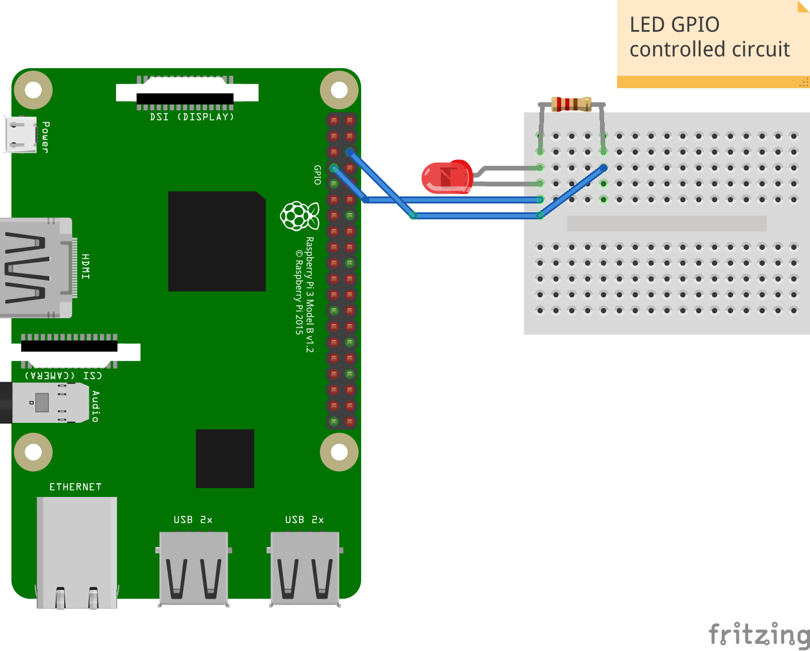

2. Turn your Pi back on by reconnecting the power cable.

3. Once your Pi has rebooted, open the python editor IDLE.


4. Select *File > New* to open a new editor window.


5. Type the following code:

```python
import RPi.GPIO as GPIO


GPIO.setmode(GPIO.BOARD)
GPIO.setup(7, GPIO.OUT)
GPIO.output(7,True)
```

6. Click *File > Save* and save this file as `led.py`.

7. Click *Run > Run Module* in IDLE to run this program. You should see the LED turn on.

To turn the LED off again, you can make a change to your program, and run it again:

Change:
```python 
GPIO.output(7,True) 
```

to:
```python
GPIO.output(7,False) 
```

\pagebreak

## Workshop 2, Exercise 3: Turning the LED on and off in Minecraft

Now we're going to make a slightly more complicated program that can turn our LED on and off in Minecraft!

1. Open Minecraft Pi, and open the selected world.


2. Create a door. It doesn't matter where it goes really, so just in front of you will do.

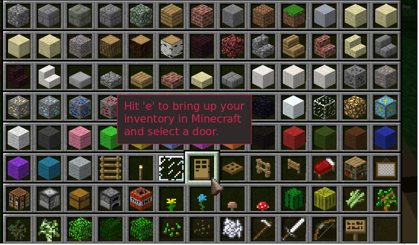

3. Select *File > New* in IDLE to open a new editor window.

4. Type in the following code:

```python
import time

from mcpi.minecraft import Minecraft
import RPi.GPIO as GPIO


GPIO.setmode(GPIO.BOARD)
GPIO.setup(7, GPIO.OUT)

mc = Minecraft.create()
LED = False

while True:
    events = mc.events.pollBlockHits()
    if len(events) > 0:
        if LED == False:
            GPIO.output(7, True)
            LED = True
        else:
            GPIO.output(7, False)
            LED = False
        mc.events.clearAll()
        time.sleep(1)
```

5. Click *File > Save* and save this file as `ledminecraft.py`.

6. Click *Run > Run Module* in IDLE to run this program.

7. In Minecraft, hit the door you made earlier with a sword and you should see the LED turn on. Hit the door again, and the LED should turn off!


Well done - you've completed the Young Coders 2016 workshop! We hope you've learned lots of new things!

If there's still time left in the workshop, feel free to explore the world (there are some hidden blocks you can look for), or spend some more time experimenting with the coding you've learned today.

If you're keen to learn more about electronics and coding, check out some of the resources under *Local Education Resources* on the next page.


\pagebreak

# Additional Resources

Below are some additional resources, both for inspiration and further learning.

## Local Education Resources

[Gasworks NZ](https://gasworks.nz) (https://gasworks.nz) - A volunteer organisation based at the Gasworks in South Dunedin, providing an excellent range of coding, robotics and electronics classes and activities for kids.

[Dunedin Makerspace](http://dspace.org.nz) (http://dspace.org.nz) - A community workshop, providing resources for electronics, crafts, art, programming and engineering.

## Raspberry Pi


### Vendors

[Nicegear](https://nicegear.co.nz) (https://nicegear.co.nz) - New Zealand based vendor of Raspberry Pi, and other electronics and embedded computing products with excellent customer support.

### Tutorials and Blogs

[Raspberry Pi StackExchange](http://raspberrypi.stackexchange.com) (http://raspberrypi.stackexchange.com) - An invaluable resource, providing answers to thousands of questions about Raspberry Pis.

[Raspberry Pi Kid](https://raspberrypikid.wordpress.com) (https://raspberrypikid.wordpress.com) - A blog by a 14 year old, journaling their learning experiences with coding and electronics using their Raspberry Pi.

## Python


[Code Academy](https://www.codecademy.com/learn/python) (https://www.codecademy.com/learn/python) - Self paced Python courses.

[Invent with Python](https://automatetheboringstuff.com/) (https://automatetheboringstuff.com/) - A free online version of the popular book, showing you how to automate tasks on your computer while learning Python.

[Official Python Documentation](https://www.python.org/doc/) (https://www.python.org/doc/) - Official docs for python 2 and 3.

\pagebreak

# Commented Code

Below are commented versions of the code used in the workshops, to help explain what each line of code does.

### Workshop 2: Magic Door

#### Basic LED program

```python

# Import the GPIO library which will let us program the GPIO pins.
import RPi.GPIO as GPIO


# Use board pin numbering, counting from 1 from the top left pin.
GPIO.setmode(GPIO.BOARD)

# Set our output to GPIO Pin 7
GPIO.setup(7, GPIO.OUT)

# Turn on GPIO Pin 7
GPIO.output(7,True)
```

#### Full Magic Door program

```python
# Import the time library, which will let us pause our program for 1 second.
import time

# Import the Minecraft library, which lets us talk to Minecraft.
from mcpi.minecraft import Minecraft
# Import the GPIO library which will let us program the GPIO pins.
import RPi.GPIO as GPIO


# Use board pin numbering, counting from 1 from the top left pin.
GPIO.setmode(GPIO.BOARD)

# Set our output to GPIO Pin 7
GPIO.setup(7, GPIO.OUT)

# This creates a new connection to our Minecraft world, so we get information about what
# Steve is up to in the Minecraft world!
mc = Minecraft.create()

# We need to store the 'state' of our LED, which can be either
# ON or OFF.
# In code, we can represent ON and OFF with True and False.
# Since the LED is OFF to start with, we'll set this to False.
LED = False

# This is the start of an infinite loop.
# Code that follows 'while True' will continue to run until
# we stop our program.
# In game programming, sometimes this is called a 'main loop,
# or 'game loop'.
while True:
    # Our Minecaft object 'mc' can tell us lots of different things
    # about what is happening in Minecraft.
    # Something happening in Minecraft is called an 'event'.
    # The events we want to know about are
    # doors opening and closing, which Minecraft stores as a BlockHit.
    # mc.events.pollBlockHits() will create a List of events if any have occured.
    events = mc.events.pollBlockHits()
    # 'len' is a function which can tell us how many events are in the list of events.
    # Here we want to check if there have been any events. If there haven't, the program
    # will start over again and check for more events later.
    if len(events) > 0:
        # Here we want to check if our LED is turned OFF or ON.
        # If our LED is turned OFF (False), we want to turn it on by setting
        # GPIO pin 7 to True.
        if LED == False:
            GPIO.output(7, True)
            # Now we need to record that we have turned ON our LED.
            LED = True
        # If our LED is already turned ON (True), we need to turn it OFF.
        else:
            # Send 'False' to GPIO pin 7 to turn it OFF.
            GPIO.output(7, False)
            # Record that we have turned our LED OFF.
            LED = False
        # Clear the list of events, since we have already processed them.
        mc.events.clearAll()
        # Pause our program for 1 second. After 1 second the loop will start
        # from the top again.
        time.sleep(1)
```
