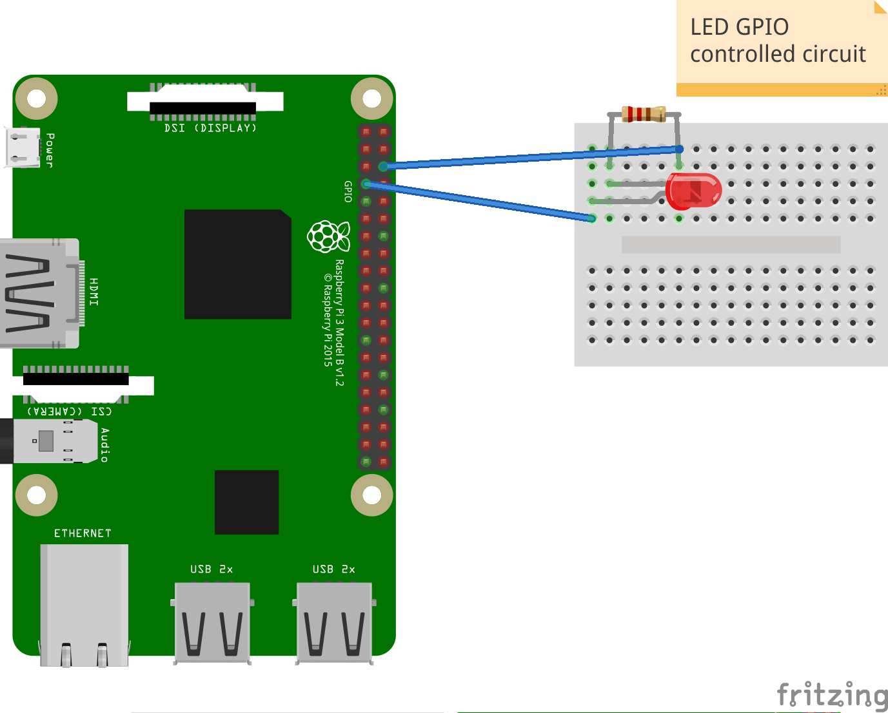

\pagebreak


# Workshop 1
## Hello World

One of the first programs you usually write, when learning how to program is 'Hello World'.
'Hello World' is a simple program which prints the text 'Hello World!' somewhere!
Today we're going to get started by printing 'Hello World!' in Minecraft.

XXX: TODO ALL THE THINGS

```python
from mcpi.minecraft import Minecraft

mc = Minecraft.create()

mc.postToChat("Hello World!")
```

# Workshop 2: Magic Door

## Getting started with the Raspberry Pi

Raspberry Pis are tiny but capable little computers, that have similar stuff inside to what you would find in a desktop PC or Mac:

* CPU (you can think of this as the brain of the computer)
* RAM (the computer's memory)
* HDMI Video port (for connecting a monitor)
* USB ports (for connecting a keyboard, mouse and other devices)
* Audio port (for connecting headphones, or speakers)


A Raspberry Pi is also a bit different from a desktop computer, as it has one very special feature - the *GPIO Port*.


The GPIO port is the set of 24 pins you see in the picture above. GPIO stands for General-purpose Input Output, and is the way the Raspberry Pi can talk to the outside world, controlling special devices, sensors and other electronic doodads. With GPIO, the raspberry Pi goes from being just a little computer, to the heart and brain of all sorts of amazing inventions. 


XXX: description of PI, explaining GPIO


XXX: Examples of cool inventions using the raspberry Pi.


\pagebreak


In this workshop, we'll be creating a Magic Door in Minecraft, using the Pi's GPIO port and some electronics components. This magic door will turn an LED connected to our PI on and off every time the door opens and shuts in Minecraft.

### Components

XXX: photo, breadboard showing underside rows

XXX: resistor

XXX: LED

XXX: male to female jumper cables


## Creating a Circuit

We're going to make a simple circuit using our breadboard now.

You might be wondering why it is calLED a breadboard. In the early days of electronics, hobbiests sometimes made circuits on *actual* breadboards. I bet their parents weren't very impressed!


While we're making our circuit, it's important that the Raspberry Pi is switched *off* to help prevent damage to our electronic components.

1. Shutdown your raspberry Pi.

XXX: image shutdown

2. Disconnect the power.

XXX: image disconnect power.

3. Wiring up our test circuit

Our first circuit is going to test that our components are working correctly and we have our circuit wired up the right way. 


4. Turn your Pi back on

If your circuit is wired up correctly, the LED should turn on when the Pi starts.

5. Shutdown, and turn your Pi off again.

6. Now we're going to move the first wire from pin 1, to the GPIO controlled pin 7.

This will allow us to turn our circuit on and off with code.



## Turning the LED on and off with code

1. Open the python editor IDLE.

XXX: screenshot of opening IDLE.

2. Select *File > New* to open a new editor window.

3. Type the following code:

**Remember: Code starting with # is a comment. Comments are there to help you
understand the code, but they aren't part of the program that runs, and you
don't need to type them.**

XXX: Make sure we have learned about comments in the first workshop

```python

# Import the GPIO library which will let us program the GPIO pins.
import RPi.GPIO as GPIO


# Use board pin numbering, counting from 1 from the top left pin.
GPIO.setmode(GPIO.BOARD)

# Set our output to GPIO Pin 7
GPIO.setup(7, GPIO.OUT)

# Turn on GPIO Pin 7
GPIO.output(7,True)
```

4. Click *Run > Run* in IDLE to run this program. You should see the LED turn on.

To turn the LED off again, you can make a change to your program, and run it again:


```python
GPIO.output(7,False) ## Turn off GPIO pin 7
```

## Turning the LED on and off in Minecraft

Now we're going to make a slightly more complicated program that can turn our LED on and off in Minecraft!


1. Open Minecraft Pi and create a door.
XXX: Screenshot of making a door

2. Select *File > New* in IDLE to open a new editor window.

3. Type in the following code:

```python
# Import the time library, which will let us pause our program for 1 second.
import time

# Import the Minecraft library, which lets us talk to Minecraft.
from mcpi.minecraft import Minecraft
# Import the GPIO library which will let us program the GPIO pins.
import RPi.GPIO as GPIO


# Use board pin numbering, counting from 1 from the top left pin.
GPIO.setmode(GPIO.BOARD)

# Set our output to GPIO Pin 7
GPIO.setup(7, GPIO.OUT)

# This creates a new connection to our Minecraft world, so we get information about what
# Steve is up to in the Minecraft world!
mc = Minecraft.create()

# We need to store the 'state' of our LED, which can be either ON or OFF.
# In code, we can represent ON and OFF with True and False.
# Since the LED is OFF to start with, we'll set this to False.
LED = False

# This is the start of an infinite loop.
# Code that follows 'while True' will continue to run until we stop our program.
# In game programming, sometimes this is called a 'main loop, or 'game loop'.
while True:
    # Our Minecaft object 'mc' can tell us lots of different things about
    # what is happening in Minecraft. When something happens in Minecraft
    # it gets recorded as an 'event'. The events we want to know about are
    # doors opening and closing, which Minecraft stores as a BlockHit.
    # mc.events.pollBlockHits() will create a List of events if any have occured.
    events = mc.events.pollBlockHits()
    # 'len' is a function which can tell us how many events are in the list of events.
    # Here we want to check if there have been any events. If there haven't, the program
    # will start over again and check for more events later.
    if len(events) > 0:
        # Here we want to check if our LED is turned OFF or ON.
        # If our LED is turned OFF (False), we want to turn it on by setting
        # GPIO pin 7 to True.
        if LED == False:
            GPIO.output(7, True)
            # Now we need to record that we have turned ON our LED.
            LED = True
        # If our LED is already turned ON (True), we need to turn it OFF.
        else:
            # Send 'False' to GPIO pin 7 to turn it OFF.
            GPIO.output(7, False)
            # Record that we have turned our LED OFF.
            LED = False
        # Clear the list of events, since we have already processed them.
        mc.events.clearAll()
        # Pause our program for 1 second. After 1 second the loop will start
        # from the top again.
        time.sleep(1)
```

4. Click *Run > Run* in IDLE to run this program.

5. In Minecraft, hit the door you made earlier with a sword and you should see the LED turn on.

Well done!


\pagebreak

# Additional Resources

XXX: Add additional resources, links to projects etc
