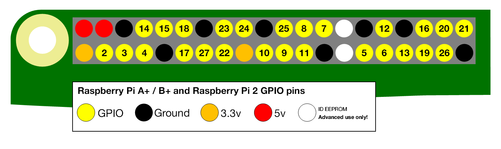

\pagebreak


# Workshop 1

## Workshop 1, Exercise 1: Hello World

One of the first programs you usually write, when learning how to program is 'Hello World'.
'Hello World' is a simple program which prints the text 'Hello World!' somewhere - usually to a terminal or console window, but today we're going to print 'Hello World!' in Minecraft!

1. Open Minecraft Pi, and open the selected world.


2. Open the python editor IDLE.


3. Select *File > New* to open a new editor window.


4. Type the following code in the new editor window:

```python
from mcpi.minecraft import Minecraft
mc = Minecraft.create()

mc.postToChat('Hello World!')
```

5. Click *Run > Run Module* in IDLE to run this program. You should see the text "Hello World!" appear in your Minecraft chat window.

### Learning about variables

In Python, we can store data in something called a variable. We're going to store a *string* in a *variable*. In Python, a string is a bit of text inside either '' or "". In our earlier code, the data was the *string* `'Hello World!'`.

Let's create a variable called `message` and assign it a different string.

We can then print the message out by calling `mc.postToChat` with it.

1. Edit your program so that it looks like the following one:

```python
from mcpi.minecraft import Minecraft
mc = Minecraft.create()

message = 'Hello Minecraft World!'
mc.postToChat(message)
```

2. Click *Run > Run Module* in IDLE to run this program. You should see the text "Hello Minecraft World!" appear in your Minecraft chat window.

### Joining string variables

We can also join strings together to print out messages with several variables.

1. Edit your program and make variables for your first name and last name.

```python
from mcpi.minecraft import Minecraft
mc = Minecraft.create()

first_name = 'Type your first name here'
last_name = 'Type your last name here'

mc.postToChat('Hello ' + first_name + ' ' + last_name + '!')
```

2. Click *Run > Run Module* in IDLE to run this program. You should see yourself greeted in the Minecraft window.

\pagebreak

## Workshop 1, Exercise 2: Let's Teleport!

XXX: Teleportation/coordinates tutorial
Now that we know about variables, we can use them to teleport Steve all over the place!

XXX: Screenshot showing coordiates in Minecraft Pi.

In Minecraft Pi, you can see your current position in the world in the top left of the screen.

Coordinates have 3 parts: x, y and z.

Let's create variables for x, y and z.


1. In IDLE, Select *File > New* to open a new editor window.

2. Type in the following code:

```python
from mcpi.minecraft import Minecraft
mc = Minecraft.create()

x = 20  XXX: Get coordinates from world on disk
y = 200
z = 15

mc.player.setTilePos(x, y, z)
```

Remember, if you want to go back to the start, change x, y and z back to their original values.

3. Click *Run > Run Module* in IDLE to run this program. You should see Steve teleported to a new location.

4. Go back to the original coordinates.

5. Try to teleport to the top of the tower. Once you have reached the top of the tower, whisper the secret message to a Young Coders helper, and get a small prize.

XXX: Make tower! (and young coder sign) in game


\pagebreak

## Workshop 1, Exercise 3: Something Cool

XXX: come up with 3rd exercise


\pagebreak


# Workshop 2: Magic Door

## Getting started with the Raspberry Pi

Raspberry Pis are tiny but capable little computers, that have similar stuff inside to what you would find in a desktop PC or Mac:

* CPU (you can think of this as the brain of the computer)
* RAM (the computer's memory)
* HDMI Video port (for connecting a monitor)
* USB ports (for connecting a keyboard, mouse and other devices)
* Audio port (for connecting headphones, or speakers)


A Raspberry Pi is also a bit different from a desktop computer, as it has one very special feature - the *GPIO Port*.


The GPIO port is the set of 24 pins you see in the picture above. GPIO stands for General-purpose Input Output, and is the way the Raspberry Pi can talk to the outside world, controlling special devices, sensors and other electronic doodads. With GPIO, the raspberry Pi goes from being just a little computer, to the heart and brain of all sorts of amazing inventions. 



XXX: description of PI, explaining GPIO


XXX: Examples of cool inventions using the raspberry Pi.


In this workshop, we'll be creating a Magic Door in Minecraft, using the Pi's GPIO port and some electronics components. This magic door will turn an LED connected to our PI on and off every time the door opens and shuts in Minecraft.

### Components

#### Breadboards

A breadboard lets us create circuits without having to solder components together. This is great when you want to experiment and change components around (the fancy name for this is *prototyping*). You can't see them under your breadboard because of the adhesive backing, but each row of 5 wee holes is connected by metal clips.

You might be wondering why it is called a breadboard. In the early days of electronics, hobbiests sometimes made circuits on *actual* breadboards. I bet their parents weren't very impressed!


#### LEDs (Light Emitting Diodes)


LEDs are electronic components that light up when a current is passed through them.

#### Resistors


A resister is a component that limits the amount of current passing through a circuit. We're going to use one to prevent our LED from burning out too soon.

#### Male to Female jumper cables


Jumper cables allow us to create a circuit from the GPIO pins to our breadboard.

\pagebreak

## Workshop 2, Exercise 1: Creating a Circuit

We're going to make a simple circuit using our breadboard now.

While we're making our circuit, it's important that the Raspberry Pi is switched *off* to help prevent damage to our electronic components.

1. Shutdown your Raspberry Pi. Click *Menu > Shutdown... > Shutdown*.


2. Wait a moment, and then disconnect the power.

XXX: image disconnect power.

3. Wiring up our test circuit

Our first circuit is going to test that our components are working correctly and we have our circuit wired up the right way. 


4. Turn your Pi back on

If your circuit is wired up correctly, the LED should turn on when the Pi starts.

5. Shutdown, and turn your Pi off again.

\pagebreak

## Workshop 2, Exercise 2: Turning the LED on and off with code

1. Now we're going to move the first wire from pin 1, to the GPIO controlled pin 7.

This will allow us to turn our circuit on and off with code.


2. Turn your Pi back on.

3. Open the python editor IDLE.


4. Select *File > New* to open a new editor window.


5. Type the following code:

```python
import RPi.GPIO as GPIO


GPIO.setmode(GPIO.BOARD)
GPIO.setup(7, GPIO.OUT)
GPIO.output(7,True)
```

6. Click *Run > Run Module* in IDLE to run this program. You should see the LED turn on.

To turn the LED off again, you can make a change to your program, and run it again:

Change:
```python 
GPIO.output(7,True) 
```

to:
```python
GPIO.output(7,False) 
```

\pagebreak

## Workshop 2, Exercise 3: Turning the LED on and off in Minecraft

Now we're going to make a slightly more complicated program that can turn our LED on and off in Minecraft!

1. Open Minecraft Pi, and open the selected world.


2. Create a door. It doesn't matter where it goes really, so just in front of you will do.


3. Select *File > New* in IDLE to open a new editor window.

4. Type in the following code:

```python
import time

from mcpi.minecraft import Minecraft
import RPi.GPIO as GPIO


GPIO.setmode(GPIO.BOARD)
GPIO.setup(7, GPIO.OUT)

mc = Minecraft.create()
LED = False

while True:
    events = mc.events.pollBlockHits()
    if len(events) > 0:
        if LED == False:
            GPIO.output(7, True)
            LED = True
        else:
            GPIO.output(7, False)
            LED = False
        mc.events.clearAll()
        time.sleep(1)
```

5. Click *Run > Run Module* in IDLE to run this program.

6. In Minecraft, hit the door you made earlier with a sword and you should see the LED turn on. Hit the door again, and the LED should turn off!

Well done!


\pagebreak

# Additional Resources

Below are some additional resources, both for inspiration and further learning.

## Local Education Resources

[Gasworks NZ](https://gasworks.nz) (https://gasworks.nz) - A volunteer organisation based at the Gasworks in South Dunedin, providing an excellent range of coding, robotics and electronics classes and activities for kids.

[

## Raspberry Pi


### Vendors

[Nicegear](https://nicegear.co.nz) (https://nicegear.co.nz) - New Zealand based vendor of Raspberry Pi, and other electronics and embedded computing products with excellent customer support.

### Tutorials and Blogs

[Raspberry Pi StackExchange](http://raspberrypi.stackexchange.com) (http://raspberrypi.stackexchange.com) - An invaluable resource, providing answers to thousands of questions about Raspberry Pis.

[Raspberry Pi Kid](https://raspberrypikid.wordpress.com) (https://raspberrypikid.wordpress.com) - A blog by a 14 year old, journaling their learning experiences with coding and electronics using their Raspberry Pi.

## Python


[Code Academy](https://www.codecademy.com/learn/python) (https://www.codecademy.com/learn/python) - Self paced Python courses.

[Invent with Python](https://automatetheboringstuff.com/) (https://automatetheboringstuff.com/) - A free online version of the popular book, showing you how to automate tasks on your computer while learning Python.

[Official Python Documentation](https://www.python.org/doc/) (https://www.python.org/doc/) - Official docs for python 2 and 3.

\pagebreak

# Commented Code

Below are commented versions of the code used in the workshops, to help explain what each line of code does.

### Workshop 2: Magic Door

#### Basic LED program

```python

# Import the GPIO library which will let us program the GPIO pins.
import RPi.GPIO as GPIO


# Use board pin numbering, counting from 1 from the top left pin.
GPIO.setmode(GPIO.BOARD)

# Set our output to GPIO Pin 7
GPIO.setup(7, GPIO.OUT)

# Turn on GPIO Pin 7
GPIO.output(7,True)
```

#### Full Magic Door program

```python
# Import the time library, which will let us pause our program for 1 second.
import time

# Import the Minecraft library, which lets us talk to Minecraft.
from mcpi.minecraft import Minecraft
# Import the GPIO library which will let us program the GPIO pins.
import RPi.GPIO as GPIO


# Use board pin numbering, counting from 1 from the top left pin.
GPIO.setmode(GPIO.BOARD)

# Set our output to GPIO Pin 7
GPIO.setup(7, GPIO.OUT)

# This creates a new connection to our Minecraft world, so we get information about what
# Steve is up to in the Minecraft world!
mc = Minecraft.create()

# We need to store the 'state' of our LED, which can be either
# ON or OFF.
# In code, we can represent ON and OFF with True and False.
# Since the LED is OFF to start with, we'll set this to False.
LED = False

# This is the start of an infinite loop.
# Code that follows 'while True' will continue to run until
# we stop our program.
# In game programming, sometimes this is called a 'main loop,
# or 'game loop'.
while True:
    # Our Minecaft object 'mc' can tell us lots of different things
    # about what is happening in Minecraft.
    # Something happening in Minecraft is called an 'event'.
    # The events we want to know about are
    # doors opening and closing, which Minecraft stores as a BlockHit.
    # mc.events.pollBlockHits() will create a List of events if any have occured.
    events = mc.events.pollBlockHits()
    # 'len' is a function which can tell us how many events are in the list of events.
    # Here we want to check if there have been any events. If there haven't, the program
    # will start over again and check for more events later.
    if len(events) > 0:
        # Here we want to check if our LED is turned OFF or ON.
        # If our LED is turned OFF (False), we want to turn it on by setting
        # GPIO pin 7 to True.
        if LED == False:
            GPIO.output(7, True)
            # Now we need to record that we have turned ON our LED.
            LED = True
        # If our LED is already turned ON (True), we need to turn it OFF.
        else:
            # Send 'False' to GPIO pin 7 to turn it OFF.
            GPIO.output(7, False)
            # Record that we have turned our LED OFF.
            LED = False
        # Clear the list of events, since we have already processed them.
        mc.events.clearAll()
        # Pause our program for 1 second. After 1 second the loop will start
        # from the top again.
        time.sleep(1)
```
