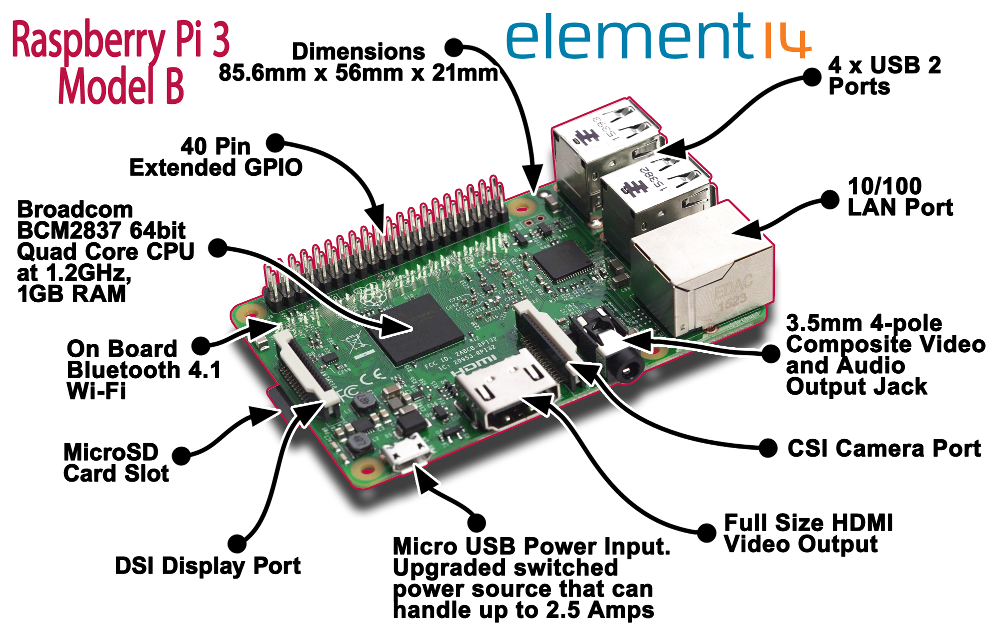

# Young Coders Minecraft Pi Python Workshop, Companion Guide for Educators

## Introduction

### What is Python?

Python is one of the most widely used computer programming languages in the world. Python is used by software engineers, web developers, game developers, scientists, mathematicians, educators and even artists! 

### Why learn and teach Python?

Python has a clear, simply syntax that makes it an ideal introductory programming language. 

...

### Raspberry Pi Overview

The Raspberry Pi is a low-cost, credit card-sized single-board computer developed in the United Kingdom by the [Raspberry Pi Foundation](https://www.raspberrypi.org) to promote the teaching of basic computer science in schools and developing countries.

The Raspberry Pi is equipped with many of the features you would expect from a desktop computer: wifi and ethernet networking, HDMI video output and USB ports for connecting peripherals.

Additionally the Raspberry Pi features a GPIO port, or general purpose input/output port, which provides a low level interface for interacting with the real world.

You can think of these pins as switches, able to turn on LEDs or send data to external devices. 
